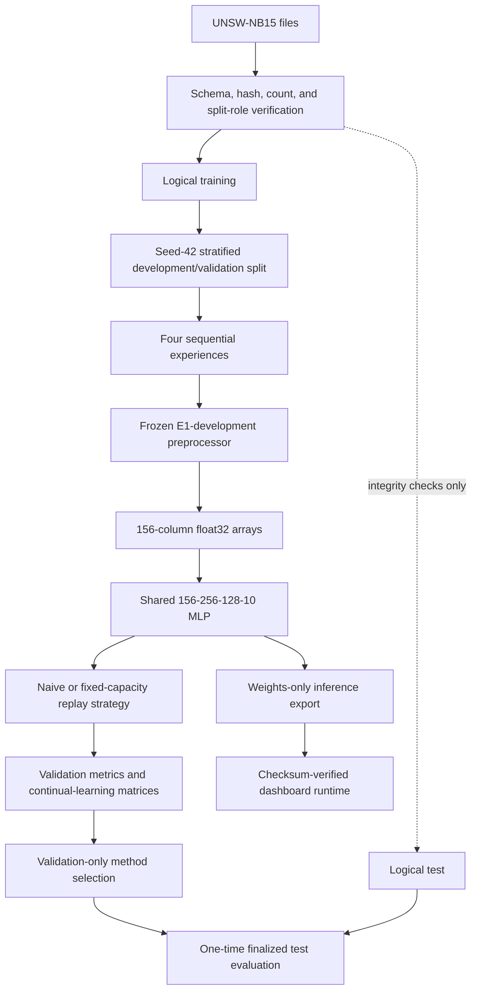

# Architecture

TAFR-IDS separates dataset-dependent research code from the tracked inference runtime. The training pipeline produces fingerprinted local artifacts; the public runtime consumes only finalized result summaries and minimal inference bundles.

The dotted edge is deliberately narrow: before the final gate, logical test is limited to the structural integrity checks authorized by the protocol. It never supplies fitting, feature selection, task design, model selection, or replay information.

## Data and split boundary

`tafr_ids.data.inspection` verifies the expected files, ordered schema, counts, hashes, parsing, ID integrity, and configured logical roles. Consumers use `verified_split_paths`; they never infer a split from a physical filename. The current mirror's physical train/test filenames are swapped and pinned in `configs/unsw_nb15_splits.toml`.

`tafr_ids.data.loader` reads logical training, canonicalizes `attack_cat`, verifies the binary `label`, and excludes `id` and both targets from the 42-column feature frame. `tafr_ids.data.splits` creates the fixed 80/20 row-stratified development/validation assignment. `tafr_ids.data.experiences` applies the locked E1–E4 allocation and gives each experience a different subset of Normal records.

Generated preparation arrays, assignments, and Joblib state stay under ignored `artifacts/`; raw data stays external or under ignored data directories.

## Frozen preprocessing

`FrozenPreprocessor` wraps a scikit-learn `ColumnTransformer`:

- 39 numeric columns: E1-development median imputation and standardization;
- `proto`, `service`, and `state`: E1-development most-frequent imputation and one-hot encoding with unknown categories ignored;
- output: 156 finite `float32` columns in a recorded order.

The wrapper accepts exactly one fit on E1 development and rejects refitting. Every later development/validation subset and the one-time final test uses transform only. The public runtime uses the same frozen object exported as `models/shared/preprocessor.skops` with an exact type allowlist.

## Classifier and continual loop

All five methods use `TabularMLP`: `156 → 256 → 128 → 10`. Each hidden linear layer is followed by LayerNorm, ReLU, and dropout 0.20. Training uses unweighted cross-entropy, AdamW, 20 epochs per experience with the final epoch retained, deterministic seed 42, and an optimizer reset at each experience while model weights continue forward.

The shared runner evaluates random initialization and every validation experience after each training experience. Validation results are observational: they do not alter training or choose an epoch.

## Replay buffer and TAFR allocation

Uniform Replay, TAFR-F, TAFR-FU, and Full TAFR share the same 2,000-item replay capacity and current/replay batch composition. After each experience, eligible candidates are only the retained buffer plus current development rows. Discarded historical rows cannot return.

TAFR changes class quotas, not the network or batch algorithm. It independently normalizes retained-memory forgetting, candidate uncertainty, and cumulative-support rarity, then combines the active signals for each ablation. Bounded largest-remainder quotas and SHA-256-derived within-class permutations make selection deterministic. Exact formulas are in `docs/tafr_method.md`.

## Evaluation and public results

`tafr_ids.evaluation` produces accuracy, balanced accuracy, Macro-F1, weighted F1, per-class values, fixed-order confusion matrices, continual-learning matrices, forgetting, and forward transfer. Full TAFR was selected by the predefined validation ranking before test access. The final-test pass is complete and cannot be used for further development.

Concise public outputs live in `results/`. Full checkpoints and detailed generated records remain ignored because they include training-only state and are not needed by a new dashboard user.

## Inference and dashboard runtime

`tafr_ids.inference.bundle` verifies `models/shared/SHA256SUMS`, validates shared schema/class metadata, loads weights with safetensors, and loads the skops preprocessor only after its untrusted-type set exactly matches the project allowlist. It constructs the same MLP architecture and requires every state-dict key and shape to match.

`dashboard/data.py` validates uploaded CSVs, prepares raw features, verifies scenario archives, and returns class probabilities. `dashboard/app.py` resolves all paths from the repository location rather than the caller's working directory. Dashboard charts come from tracked `results/dashboard_data.json`; inference and Attack Simulation come from tracked `models/` assets. No dashboard path reads raw data, validation arrays, logical-test rows, or complete checkpoints.

See [reproducibility](reproducibility.md), [inference assets](inference_assets.md), and the [experimental protocol](experimental_protocol.md) for the operational contracts.
